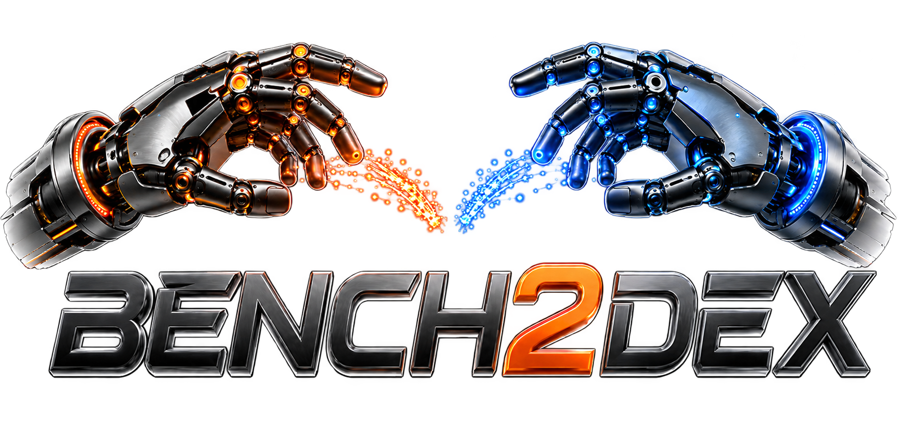

<p align="center">
  
</p>

<p align="center">
  <strong>Benchmarking Visuo-Tactile Bimanual Dexterous Manipulation Across Dexterous Hands</strong>
</p>

<p align="center">
  <a href="https://arxiv.org/abs/2609.15726">
  
  </a>
  <a href="https://bench2dex.github.io/">
    
  </a>
  <a href="https://modelscope.cn/datasets/Bench2Dex">
    
  </a>
  <a href="https://bench2dex.github.io/doc/">
    
  </a>
</p>

<p align="center">
  
  
  
  
</p>

<p align="center">
  Built on <a href="https://github.com/isaac-sim/IsaacLab">Isaac Lab</a> for multimodal data collection and systematic generalization evaluation across long-horizon manipulation tasks.
</p>

---

## 🎬 Overview

https://github.com/user-attachments/assets/f15a763d-bb88-4d02-a491-bf88689198fe

## 🛠️ Environment Installation

```bash
# Create and activate a fresh environment
conda create -n env_isaaclab python=3.11 -y
conda activate env_isaaclab
python -m pip install --upgrade pip

# Install Isaac Sim 5.1.0
python -m pip install "isaacsim[all,extscache]==5.1.0" \
  --extra-index-url https://pypi.nvidia.com

# Install the CUDA 12.8 builds of PyTorch
python -m pip install \
  torch==2.7.0 \
  torchvision==0.22.0 \
  --index-url https://download.pytorch.org/whl/cu128

# Install the remaining Bench2Dex Python packages
python -m pip install numpy==1.26.4 Flask h5py

# Clone Isaac Lab v2.3.2
git clone --branch v2.3.2 --depth 1 https://github.com/isaac-sim/IsaacLab.git

# Install Isaac Lab in editable mode
cd IsaacLab/source/isaaclab
python -m pip install -e .
```

## 📦 Download Assets and Checkpoints

Download the assets, teleoperation dataset, and pretrained policy checkpoints from ModelScope:

- Assets: [Bench2Dex assets](https://modelscope.cn/datasets/Bench2Dex/Bench2Dex)
- Dataset: [Bench2Dex teleoperation data](https://modelscope.cn/datasets/Bench2Dex/teleopdata)
- Pretrained weights: [Bench2Dex policy checkpoints](https://modelscope.cn/datasets/Bench2Dex/policy_ckpt)

```text
root_path/
├── Bench2Dex/             # Code
├── dex2bench_dataset/     # Assets (scenes, robot models, etc.)
├── teleopdata/            # Teleoperation dataset
└── policy_ckpt/           # Pretrained policy checkpoints
```


## 🧤 Teleoperation Data Collection

### Steps

1. **Open the streaming app on iPhone**: [Download link](https://drive.google.com/file/d/1PYm4ajw080JWVTRTitnRb_KGJq3ysYwJ/view?usp=sharing)

2. **Start the Manus glove SDK client** (reads glove data and writes to shared memory `/manus_hand_data`):
   ```bash
   cd dex2bench/teleop/manus_bin
   ./SDKClient_Linux.out 1
   ```

3. **Launch simulation + teleoperation + data collection** (`--collect-config` defaults to `configs/collect/default.yaml`):
   ```bash
   python main.py --teleop --collect --enable-generalization \
     --task scenes/<task>.yaml
   ```
   Scene, lighting, and background are automatically randomized between episodes (generalization).

4. **Put on the Manus gloves and get into position**

5. **Tap the "Start Streaming" button on the iPhone app** — glove data is streamed via shared memory to the `TeleopController`, then remapped to robot joint targets through DexPilot retargeting

6. **Use the three foot pedals to control recording** (USB foot switches, emulating keyboard keys):

   | Pedal | Key Mapping | Function |
   |-------|------------|----------|
   | Pedal 1 | PageDown | **Home** — robot returns to home position |
   | Pedal 2 | Home | **Start recording** — creates `episode_NNNNNN.hdf5` |
   | Pedal 3 | End | **Stop recording** — finalizes the current episode |

   Per-frame data recorded includes: `robot/qpos` (joint positions), `action/commanded` (teleop commands), multi-view camera RGB images (6 cameras), object poses, etc. The keyboard has an equivalent mapping (Numpad 1/2/3 correspond to Home/Start/Stop).

## 🔁 Replay

Raw teleoperation only records joint states and object poses. The **replay** step loads each episode, re-builds the scene, and replays the trajectory frame-by-frame to capture camera data and tactile.

```bash
python tools/replay/batch_replay.py \
    --origin-dir ../teleopdata/dataset/06_fruit_bowl_loading/origin-generalization-double \
    --replay-dir ../teleopdata/dataset/06_fruit_bowl_loading/replay-generalization-double \
    --enable-rgb --enable-tactile \
    --resample-groups background,table_surface,light,camera \
    --generalization-split seen \
    --headless
```

> **Note**: `--enable-depth` is currently disabled in practice because depth data is too storage-heavy. Pre-collected and replayed datasets are available for download from ModelScope (see the [Download section](#download-assets-and-checkpoints)).

## 🧹 Policy Data Preparation

Before training or adapting any policy, ensure that each HDF5 episode contains a valid `meta/homing_start_sim_step`. This explicit marker records the simulation step at which the operator starts the return-to-home motion; it is not inferred from the robot joint positions. During data preprocessing, locate the first frame whose `time/sim_step` is greater than or equal to this marker and truncate the episode before that frame, so the homing frame and all subsequent return-to-home motion are excluded from both training samples and normalization statistics. The provided ACT, Diffusion Policy, Pi0.5, and GR00T N1.5 pipelines follow this convention, and custom policy pipelines should apply the same cutoff.


## 🤖 Policy Usage

For environment setup, training, and evaluation guidance for all four supported policies, see the **Policy Usage** chapter in the [Bench2Dex Documentation](https://bench2dex.github.io/doc/).

## 🧩 Task Description

For a complete list of all 26 tasks with detailed descriptions grouped by robot embodiment, see the **Tasks** chapter in the [Bench2Dex Documentation](https://bench2dex.github.io/doc/).

## Community

We welcome researchers and developers interested in Bench2Dex to join our community for discussions on dexterous manipulation, teleoperation, visuo-tactile learning, and benchmark development.

We maintain a **Bench2Dex WeChat group** for community discussions.

For technical questions, bug reports, and feature requests, please use [GitHub Issues](https://github.com/Bench2Dex/Bench2Dex/issues).

<p align="center">
  
</p>

## 📝 Citation
```bibtex
@article{yang2026bench2dex,
  title={Bench2Dex: Benchmarking Visuo-Tactile Bimanual Dexterous Manipulation Across Dexterous Hands},
  author={Yang, Zhenjie and Zhang, Yideng and Zhang, Dongjie and Jiang, Chenyu and Liu, Xianshuai and Li, Yufeng and Ge, Zuhao and Jiao, Xingyu and Zhang, Zheng and He, Kaiyu and Wang, He and Zhong, Yuwen and Deng, Yi and Jiang, Muyun and Huang, Xianliang and Su, Haisheng and Zhang, Donghang and Zhang, Jian and Yang, Xue and Li, Hongyang and Wu, Zuxuan and Jiang, Yu-Gang and Jia, Xiaosong and Yan, Junchi},
  journal={arXiv preprint arXiv:2609.15726},
  year={2026}
}
```

## 🙏 Acknowledgements

We thank the contributors to [Isaac Lab](https://github.com/isaac-sim/IsaacLab), [RoboTwin](https://github.com/robotwin-Platform/RoboTwin), [DexUMI](https://github.com/real-stanford/DexUMI), [ACT](https://github.com/tonyzhaozh/act), [Diffusion Policy](https://github.com/real-stanford/diffusion_policy), [OpenPI](https://github.com/Physical-Intelligence/openpi), and [Isaac-GR00T](https://github.com/NVIDIA/Isaac-GR00T) for their open-source contributions to robotics and dexterous manipulation research.